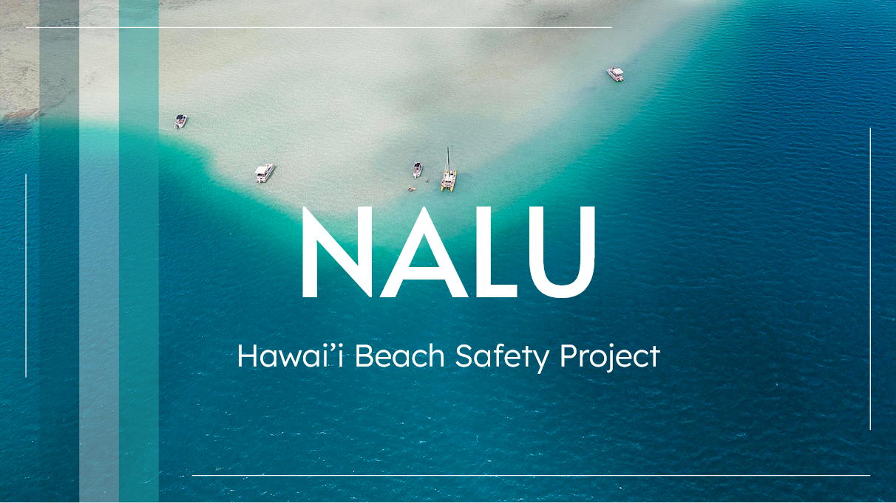
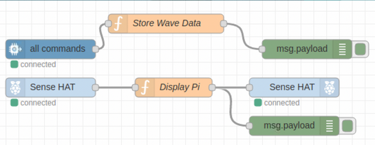
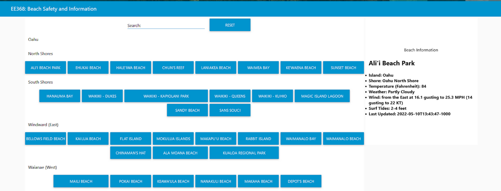

Nalu is a web interface that I helped create as a team project in EE 368, Spring 2022. The project helped me learn how to design and implement a website interface with buttons.

Nalu is implemented using [Node RED](https://nodered.org/), a programming tool for wiring together hardware devices, APIs and online services in new and interesting ways. Within a few weeks, we created a website interface that displays the chosen beach conditions. We also connected the website to a Raspberry Pi using the [IBM Cloud](https://www.ibm.com/cloud).

In this project I gained experience with using JSON and reading APIs using Node RED and the IBM Cloud alongside being able to have the Raspberry Pi receive user inputs to display certain values. 

